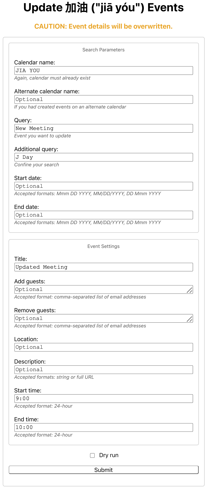
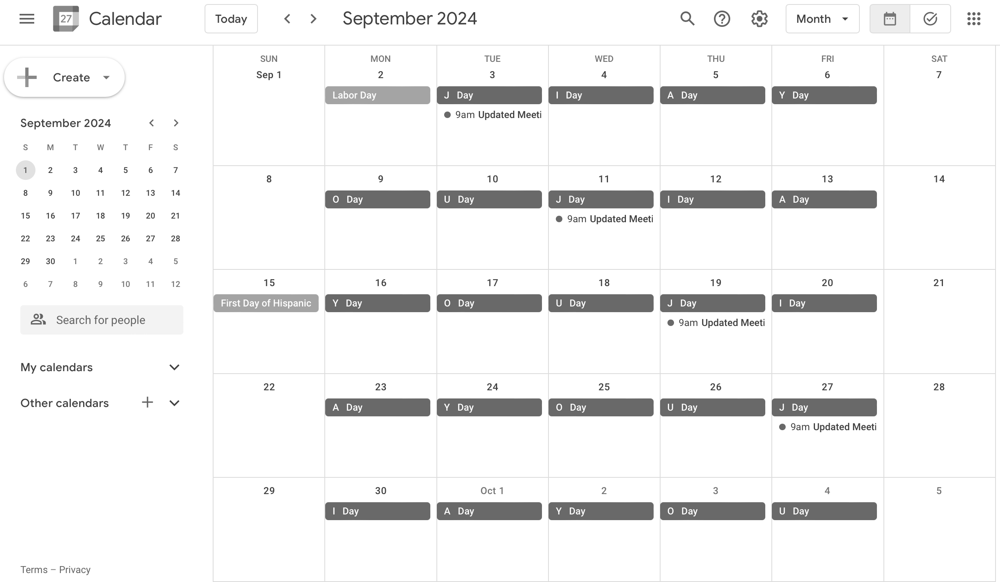

# Update 加油 ("jiā yóu") Events (Deprecated)

Google Web app for batch updating events on only certain letter days (e.g., on only "J Day's"). Modify as needed, and back up your calendars before you run the app. ~~These events are not recurring events, so without a batch script one would need to update these events manually~~ As of commit 28b85c61743f0ebf5d10eafae8032a63bbfa069c, they are recurring events, so a batch script is no longer necessary.

```
CAUTION: Event details will be overwritten.
```

## Visual Example

<br>Form for updating "JIA YOU" events. (Sans the form color.)

<br>Event titles changed from "New Meeting" to "Updated Meeting," and start times changed from 10 AM to 9 AM. (See [here](https://github.com/saegl5/jiayou_add_events) how the events appeared before updating them.)

## Prerequisites

1. Access to [Google Apps Script](https://script.google.com/)
2. 加油 ("jiā yóu") calendar must already exist. If it doesn't, consult the [Web app for creating the calendar](https://github.com/saegl5/jiayou_create_calendar).
3. Calendar events must also already exist. If they don't, consult the [Web app for adding events](https://github.com/saegl5/jiayou_add_events).

## Getting Started

1. Go to [Google Apps Script](https://script.google.com/), and create a new project.
2. Copy and paste [the script](./Code.gs) into the editor, and save the file.
3. Run the script to acquire authorization.
4. Create an HTML file, and name it "Index."
5. Copy and paste [the markup text](./Index.html) into the editor, and save the file.
6. Deploy the project as a Web app, and open the assigned URL.
7. Modify the calendar name, search query, events' title, guests, location, description, start time, and end time. (Modifying the calendar name is recommended, if you had created events on an alternate calendar. **_Must name the calendar differently from the owner name, otherwise the app will not update events._** If you input a URL for the description, text to display will be "Agenda.")
8. Input an alternate calendar name, if you had created events on one. (**_Same naming convention applies._**)
9. Confine the search by inputting an additional query.
10. Confine the date range by inputting a start date and end date.
11. Optionally perform a dry run to test the Web app before running it in production. Consult logs for output.
12. Press submit. (Requires permission to make changes to events and another authorization. **_Note also that updating calendar events may be subject to a [use limit](https://support.google.com/a/answer/2905486?hl=en)._**)

## Notes

- App script does not take into account all date scenarios and it does not include additional error checks or additional guidance; features were not added because the Web app has been deprecated.
- Index file does not include consolidations and support link; features were not added because the Web app has been deprecated.

<hr>
Made with &heartsuit; in Visual Studio Code
